# Проект по автоматизации тестирования для компании оператора связи [Билайн](https://www.beeline.ru)

<p align="center"><a href="https://www.beeline.ru"></a></p>

> Билайн - крупнейший оператор, который оказывает услуги сотовой (GSM, UMTS и LTE) и фиксированной связи, проводного (FTTB) и беспроводного (Wi-Fi, «Билайн WiFi») высокоскоростного доступа в Интернет, IP-телевидения.


# 🧾 Содержание:

- [Технологии и инструменты](#computer-технологии-и-инструменты)
- [Тестовые сценарии](#clipboard-тестовые-сценарии)
- [Сборка в Jenkins](#-сборка-в-jenkins)
- [Команда для запуска](#-команда-для-запуска)
- [Allure отчет](#-allure-отчет)
- [Интеграция с Allure TestOps](#-интеграция-с-allure-testops)
- [Интеграция с Jira](#-интеграция-с-jira)
- [Уведомления в Telegram чат с ботом](#-уведомления-в-telegram-чат-с-ботом)
- [Видео запуска тестов в Selenoid](#-видео-запуска-тестов-в-selenoid)

---

<a id="tools"></a>
## 🔨 Технологии и инструменты:

| Java                                                                                                     | IntelliJ  <br>  Idea                                                                                               | GitHub                                                                                                     | JUnit 5                                                                                                           | Gradle                                                                                                     | Selenide                                                                                                         | Selenoid                                                                                                                  | Allure <br> Report                                                                                                         | Jenkins                                                                                                          | Jira                                                                                                                                    | Telegram                                                                                                            |                                                                                            Allure <br> TestOps |
|:---------------------------------------------------------------------------------------------------------|--------------------------------------------------------------------------------------------------------------------|------------------------------------------------------------------------------------------------------------|-------------------------------------------------------------------------------------------------------------------|------------------------------------------------------------------------------------------------------------|------------------------------------------------------------------------------------------------------------------|---------------------------------------------------------------------------------------------------------------------------|----------------------------------------------------------------------------------------------------------------------------|------------------------------------------------------------------------------------------------------------------|-----------------------------------------------------------------------------------------------------------------------------------------|---------------------------------------------------------------------------------------------------------------------|---------------------------------------------------------------------------------------------------------------:|
| <a href="https://www.java.com/"></a> | <a href="https://www.jetbrains.com/idea/"></a> | <a href="https://github.com/"></a> | <a href="https://junit.org/junit5/"></a> | <a href="https://gradle.org/"></a> | <a href="https://selenide.org/"></a> | <a href="https://aerokube.com/selenoid/"></a> | <a href="https://github.com/allure-framework"></a> | <a href="https://www.jenkins.io/"></a> | <a href="https://www.atlassian.com/software/jira/"></a> | <a href="https://web.telegram.org/"></a> | <a href="https://qameta.io/"></a> |


- Тесты в данном проекте написаны на языке <code>Java</code> с использованием фреймворка для тестирования [Selenide](https://selenide.org/), c применением паттерна Page Object. 
- Сборщик - <code>Gradle</code>.
- <code>JUnit 5</code> задействован в качестве фреймворка модульного тестирования.
- При прогоне тестов для запуска браузеров используется [Selenoid](https://aerokube.com/selenoid/).
- В отчетах Allure для каждого теста прикреплен не только скриншот, но и видео прохождения теста.


## :clipboard: Тестовые сценарии

- :white_check_mark: Раздел "Билайн услуги"
    - :heavy_check_mark: Проверка функции пополнения номера телефона и личного кабинета Билайн через систему быстрых платежей
    - :heavy_check_mark: Проверка заполнения форм подключения домашнего интернета с успешной территориальной возможностью подключения 
    - :heavy_check_mark: Проверка подписки на новости Билайн
- :white_check_mark: Раздел "Билайн магазин"
    - :heavy_check_mark: Проверка поисковой строки магазина Билайн
    - :heavy_check_mark: Проверка пользовательской корзины на добавление и удаление товара
- :white_check_mark: Раздел "Билайн Бизнес"
    - :heavy_check_mark: Проверка смены языка текста страницы с русского на английский
    - :heavy_check_mark: Тестирование загрузки файлов договоров Билайн с проверкой содержимого текста
    - :heavy_check_mark: Проверка наличия списка строк основного меню Билайн Бизнес

---

##  Сборка в [Jenkins](https://jenkins.autotests.cloud/job/Melnikov_A-Beeline_autotests/)

<p align="center">
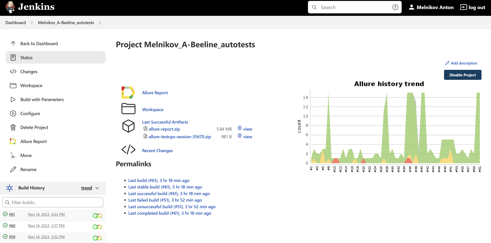
</p>

### Параметры сборки проекта

Для запуска сборки необходимо перейти в раздел <code>Собрать с параметрами</code>, выбрать необходимые параметры и нажать кнопку <code>Собрать</code>.

| Параметр        | Назначение                               |
|-----------------|------------------------------------------|
| BROWSER         | Браузер для запуска                      |
| BROWSER_VERSION | Версия браузера                          |
| BROWSER_SIZE    | Разрешение экрана                        |
| REMOTE_URL      | Удаленный сервер для запуска тестов      |
| COMMENT         | Комментарий                              |
| ENVIRONMENT     | Тестовая среда                           |
| TASK            | Опция выбора запуска определённых тестов |

### Запуск тестов с параметрами в **Jenkins**


<p align="center">
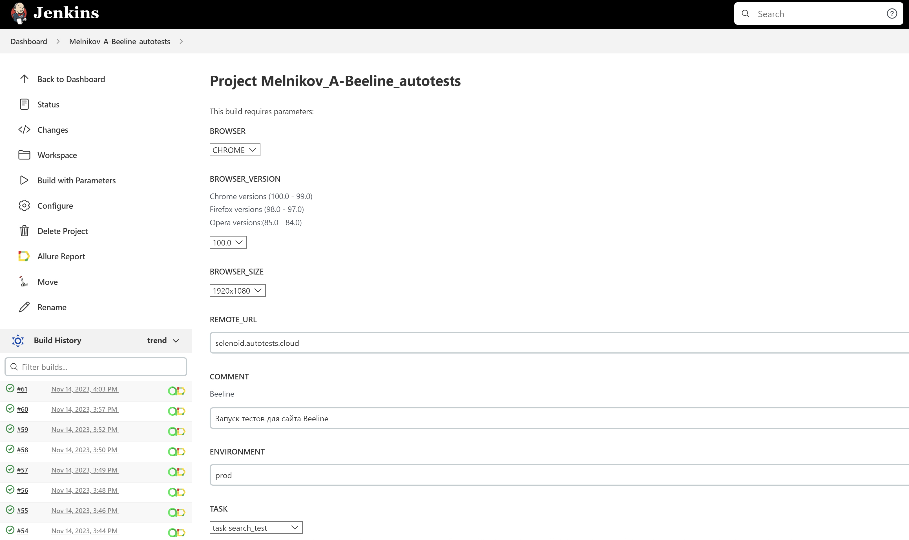
</p>

---

<a id="console"></a>
## 🚀 Команда для запуска

Удаленный запуск с использованием Jenkins и Selenoid (требуется логин и пароль):
```bash  
./gradlew clean test -Denv=remote
```
Локальный запуск
```bash  
gradle clean test 
```
---


### Варианты запуска тестов

Для запуска можно выбрать один из девяти тест-сьютов:

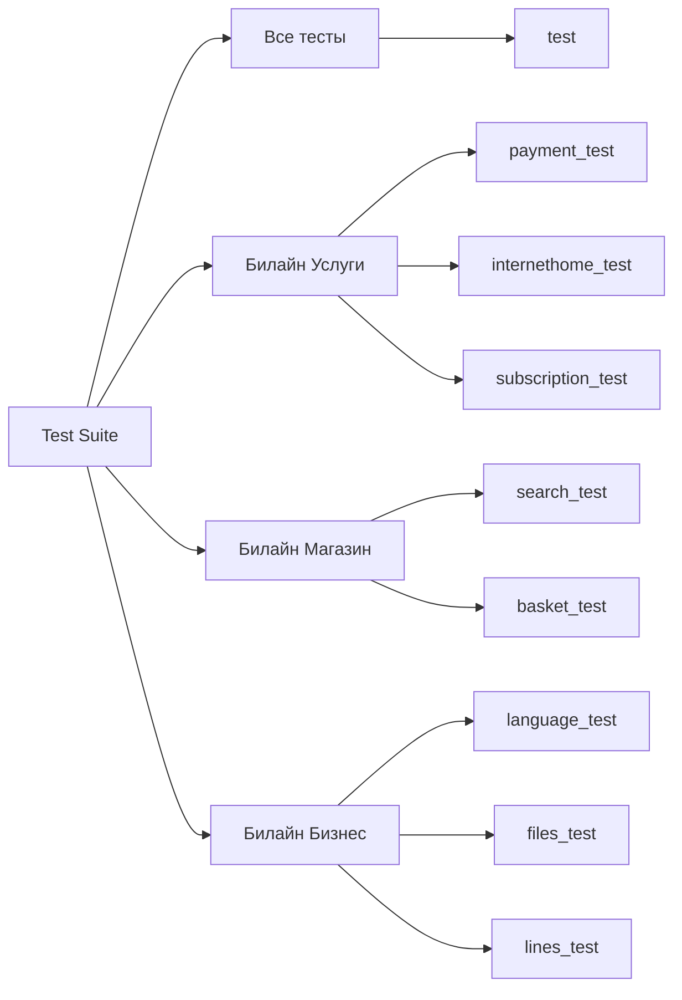
---
После выполнения сборки, в блоке История сборок напротив номера сборки появятся значки Allure Report и Allure TestOps, при клике на которые откроется страница с сформированным html-отчетом и тестовой документацией соответственно.

##  [Allure](https://jenkins.autotests.cloud/job/Melnikov_A-Beeline_autotests/61/allure/) отчет

### 🖨️ Главная страница отчета

<p align="center">
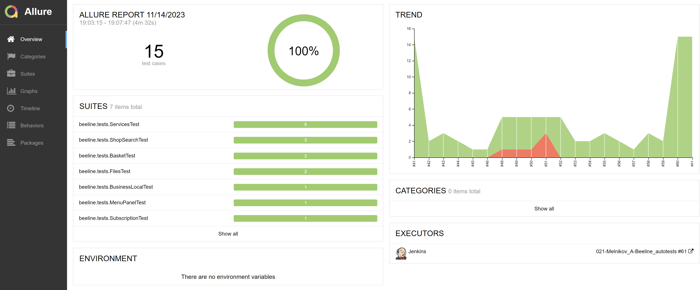
</p>

### 📄 Тест-кейсы

<p align="center">
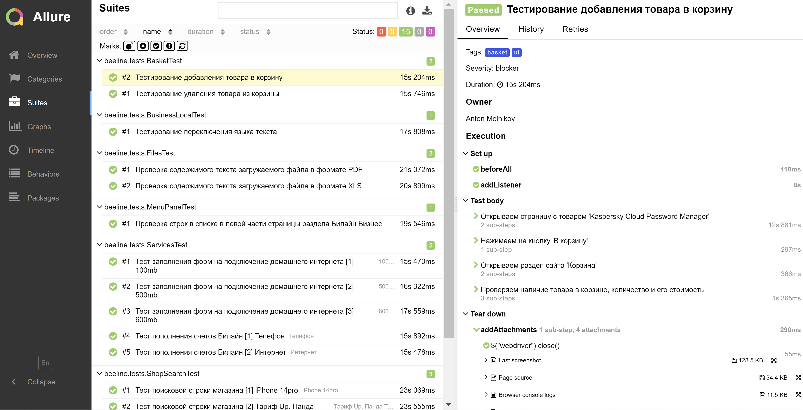
</p>

### 📊  Графики

<p align="center">
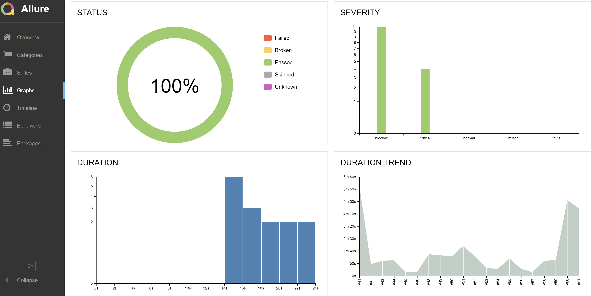
</p>

---

<a id="allure"></a>
##  </a>Интеграция с <a target="_blank" href="https://allure.autotests.cloud/project/3785/dashboards">Allure TestOps</a>
На *Dashboard* в <code>Allure TestOps</code> видна статистика количества тестов: сколько из них добавлены и проходятся вручную, сколько автоматизированы. Новые тесты, а так же результаты прогона приходят по интеграции при каждом запуске сборки.

## 🖨️ Основная страница отчёта

<p align="center">  
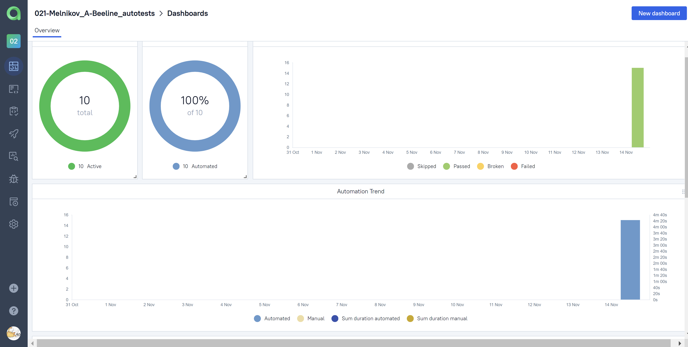  
</p>  

## 📄 Авто и Ручные тест-кейсы

<p align="center">  
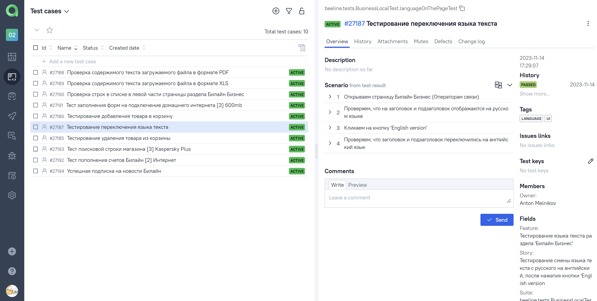  
</p>

---

##  Интеграция с [Jira](https://jira.autotests.cloud/browse/HOMEWORK-954)

Реализована интеграция <code>Allure TestOps</code> с <code>Jira</code>, в тикете отображается, какие тест-кейсы были написаны в рамках задачи и результат их прогона.
### Задача в Jira

<p align="center">
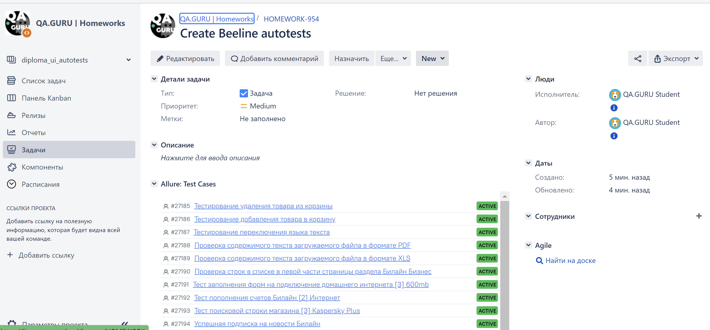
</p>

#### Содержание задачи

- :heavy_check_mark: Цель
- :heavy_check_mark: Задачи для выполнения
- :heavy_check_mark: Тест-кейсы из Allure TestOps
- :heavy_check_mark: Результат прогона тестов в Allure TestOps

---

##  Уведомления в Telegram чат с ботом

После завершения сборки специальный бот, созданный в <code>Telegram</code>, автоматически обрабатывает и отправляет сообщение с отчетом о прогоне тестов.

### Уведомление из переписки с чат ботом


<p align="center">
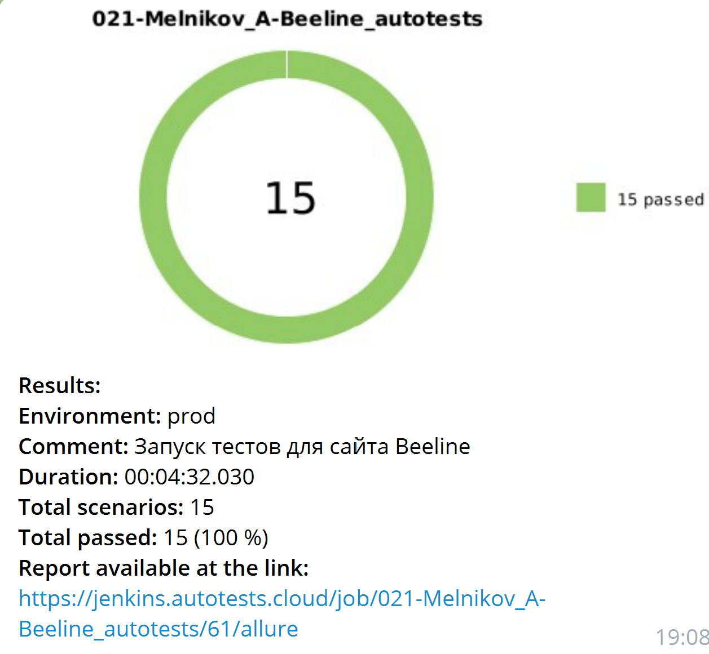
</p>


#### Содержание уведомления в Telegram

- :heavy_check_mark: Окружение
- :heavy_check_mark: Комментарий
- :heavy_check_mark: Длительность прохождения тестов
- :heavy_check_mark: Общее количество сценариев
- :heavy_check_mark: Процент прохождения тестов
- :heavy_check_mark: Ссылка на Allure отчет

---
##  Видео запуска тестов в Selenoid
В отчетах Allure для каждого теста прикреплен не только скриншот, но и видео прохождения теста
<p align="center">
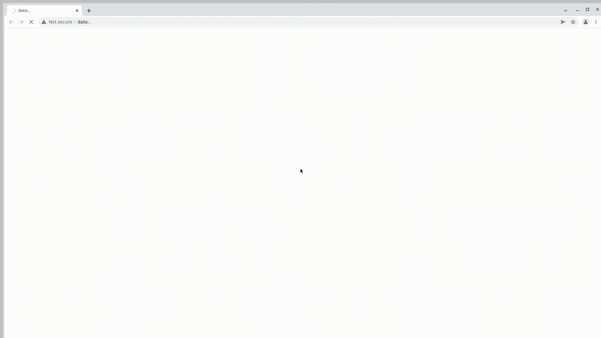
</p>